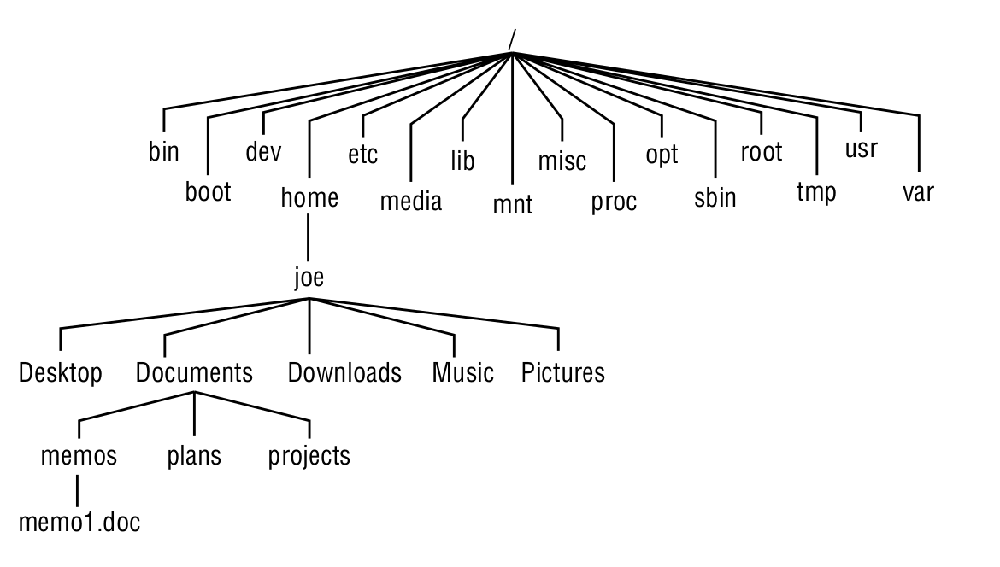

## 🔷 Linux File System

- **The Linux filesystem** - is the structure in which all of the information on your computer is stored. In fact, one of the defining properties of the UNIX systems on which Linux is based is that nearly everything you need to identify on your system (`data`, `commands`, `symbolic links`, `devices`, and `directories`) is represented by items in the filesystems.

- **In Linux**, files are organized within a **hierarchy** of directories. Each directory can contain files as well as other directories. You can refer to any file or directory using either 
  - a **full path** (for example, `/home/joe/myfile.txt`) or 
  - a **relative path** (for example, if` /home/joe` were your current directory, you could simply refer to the file as `myfile.txt`).

- If you were to map out the files and directories in Linux, it would look like an **upside-down** tree. At the top is the `root` directory (not to be confused with the root user), which is represented by a single slash `(/)`. 
- Below that is a set of common directories in the Linux system, such as `bin`, `dev`, `home`, `lib`, and `tmp`, to `name` a `few`. 
- Each of those directories, as well as directories added to the `root` directory, can contain subdirectories.

  - **The Linux filesystem is organized as a hierarchy of directories.**
        

**************************************************

### 🔹Using Basic Filesystem Commands
    
    
- **Commands to Create and Use Files**
   - **cd**  -  Changes to another directory
   - **pwd**  -  Prints the name of the current (or present) working directory
   - **mkdir**  -  Creates a directory
   - **chmod**  - Changes the permission on a file or directory
   - **ls**  -  Lists the contents of a directory

### 🔹 Using file-matching metacharacters

- To save you some keystrokes and enable you to refer easily to a group of files, the bash shell lets you use **metacharacters**. 
- Anytime you need to refer to a file or directory, such as to list, open, or remove it, you can use metacharacters to match the files you want. Here aresome useful metacharacters for matching filenames:

  - **\*** -  Matches any number of characters.
  - **?** - Matches any one character.
  - **[...]** - Matches any one of the characters between the brackets, which can include a hyphen-separated range of letters or numbers.